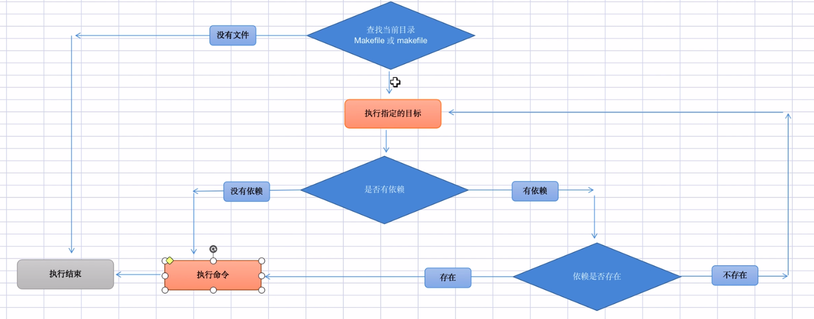

# <center>Makefile</center>
## __<font color="#006666">基本语法:</font>__

```
目标:依赖
Tab 命令
```
- 目标：一般是指要编译的目标，可以是一个动作
- 依赖：指执行当前目标所要依赖的项，包括其它目标，某个具体文件或库等，一个目标可以有多个依赖
- 命令：该目标下要执行的的具体命令，可以没有，也可以有多条，多条时，每条命令一行

## __<font color="#006666">常用选项:</font>__
- -f 可以指定makefile的名称
- -n 只输出命令，但不执行
- -v 显示版本号
- -s 只执行命令，但不显示具体命令，此处可在命令中用@符命令抑制命令输出
-  -w 显示执行前执行后的路径
-  -C dir 指定makefile所在的目录
  
## __<font color="#006666">注意:</font>__
- 没有指定目标时，默认使用第一个目标
- 如果指定，则执行对应的命令
  
## __<font color="#006666">编译流程详解:</font>__
- 预处理 g++ -E main.cpp > main.ii
- 编译 g++ -S main.ii  得到main.s的汇编文件
- 汇编 g++ -c main.s 得到main.o(.obj)的二进制文件
- 链接 g++ -lstdc++ main.o -o main 得到main.out

## __<font color="#006666">makefile变量:</font>__
- $* 不包括扩展名的目标文件名称
- $+ 所有的依赖文件，以空格分隔
- $< 表示规则中的第一个条件
- $? 所有时间戳比目标文件晚的依赖文件，以空格分隔
- $@ 目标文件的完整名称
- $^ 所有不重复的依赖文件，以空格分隔
- $% 如果目标是归档成员，则该变量表示目标的归档成员名称

## __<font color="#006666">系统常量(可用make -p 查看)</font>__
- AS 汇编程序的名称 默认为as
- CC c编译器名称 默认cc
- CPP c预编译器名称 默认cc -E
- CXX C++编译器名称， 默认g++
- RM 文件删除程序别名 默认rm -f

## __<font color="#006666">自定义变量:</font>__
- 定义： 变量名=变量值
- 使用： $(变量名)/${变量名}

## __<font color="#006666">伪目标和模式匹配:</font>__
- 伪目标 .PHONY:clean
  - 声明目标为伪目标之后，makefile将不会判断目标是否存在或该目标是否需要更新

- 模式匹配 %.
  
## __<font color="#006666">运行流程:</font>__

- 保证目标是用最新的依赖生成的
- 第一次完全编译，后边只编译最新的代码(部分编译)

## __<font color="#006666">makefile中编译动态链接库(.dll .so):</font>__
- 动态链接库:不会把代码编译到二进制文件中，而是在运行时才去加载 ，所以只需要维护一个地址
- fPIC 产生位置无关的代码
- shared 共享
- -l(小l)指定动态库
- -I(大L)指定头文件目录，默认当前目录
- -L(大 L)手动指定库的搜索目录，默认只链接共享目录

## __<font color="#006666">动态链接库:</font>__
- 动态：运行时才去加载 动态加载 
- 链接： 指库文件和二进制程序分离，用某种特殊手段维护两者之间的关系
- 库：库文件.dll .so
- 好处：程序可以和库文件分离，可以分别发版，库文件可以被多处共享
- 命令规则:libSoTest.so
- g++ -shared -fPIC SoTest.cpp -o libSoTest.so
- g++ -lSoTest -L./ test.cpp -o test
- g++ -lSoTest -L../004 main.cpp -o ma
  
## __<font color="#006666">查看库文件中的函数</font>__
- readelf -a libSoTest.so |grep func1
- nm libSoTest.so |grep func1
- objdump -DC main > main.txt

## __<font color="#006666">linux默认动态库路径配置文件</font>__
- /etc/ld.so.conf 
- /etc/ld.so.conf.d/*.conf
- /usr/lib
- /usr/local/lib
- mac 系统下指定环境亦是 DYLD_LIBARY_PATH=../004 export DYLD_LIBRARY_PATH
- linux系统下 LD_LIBARY_PATH=../004  export LD_LIBRARY_PATH

## __<font color="#006666">静态库</font>__
- g++ -c aTest.cpp -o aTest.o       
- ar -r libaTest.a aTest.o

## __<font color="#006666">=与:=</font>__
- Makefile中的指令都是先展开所有变量，再调用指令
- = 赋值，但是用终值，就是不管调用写在赋值前还是赋值后，调用的都是终值
- := 也是赋值，但是只受当前行及之前的代码影响，而不受后面的赋值影响

## __<font color="#006666">Makefile调用shell</font>__
- $(shell )

## __<font color="#006666">Makefile条件判断</font>__
- ifeq,ifneq 与条件括号之间要有空格，不然会报错
- 没有elseif的用法，如果要实现elseif就要写嵌套
- 可以只有if判断没有else
- 命令行传参 make -f Makefile FLAG=123 如果有Makefile,则可写成make FLAG=456

## __<font color="#006666">Makefile中的循环</font>__
- $(foreach v, $(TARGET), $v.txt)
- 只支持GUN make其它平台make可以用shell中的循环来实现

## __<font color="#006666">Makefile中的函数</font>__
- define FUNC1 endef(定义和实现)参数是$(0)....$(5)
- $(call FUNC1 abc,efd)(调用)
- 没有返回值
- $(0)是函数名

## __<font color="#006666">make-install</font>__
- 1.make:将源文件编译成二进制可执行文件(包括各种库文件)
- 2.创建目录，将可执行文件拷贝到指定目录(安装目录)
- 3.加全局可执行路径
- 4.全局的启停脚本
- 5.重置编辑环境，删除无关文件
  
## __<font color="#006666">Make file 换行符（反斜杠\）的用法</font>__
- 末尾加"\"
- 第二行前不得为tab键，空格即可