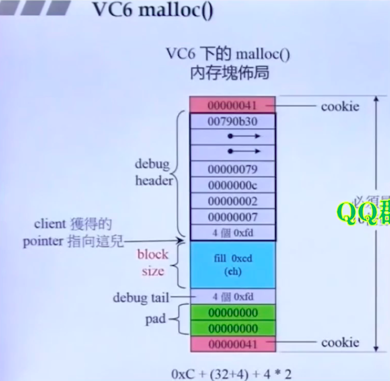
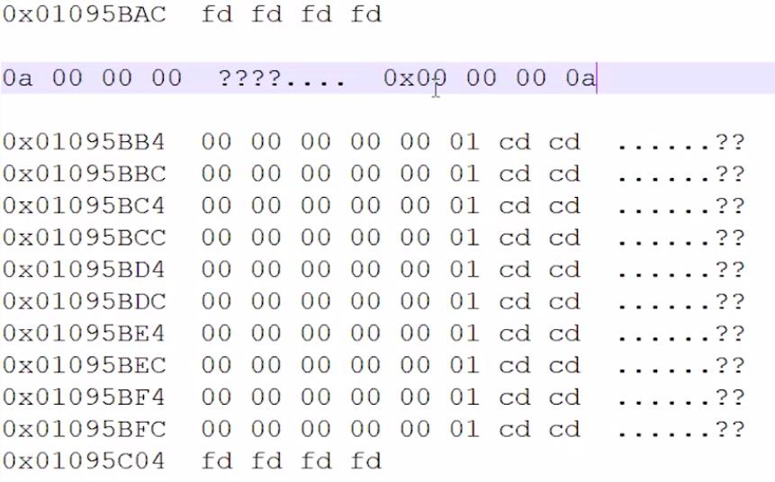

# __
内存
__
## __内存大小__
- 内存对齐
- 空类的大小
- 包含1到N个虚函数的类内存大小
- 有继承的虚函数类的大小

## __内存分配__
- new/delete, new[] / delete[]
- placement new
- malloc/free
- ::operator new ::operator delete
- 重载operator new operator delete

## __实际分配内存和返回给用户的内存__

- cookie记录分配的内存大小 4byte 2个cookie 8byte 值为0x00000041 = 64 + 1(这个1是表示内存被分配出去了，不是内存大小) 4* 16 = 64
- Debug header：32byte
- Debug tail:固定4byte
- 内存最终是16的倍数(根据平台的不同)
  

  

