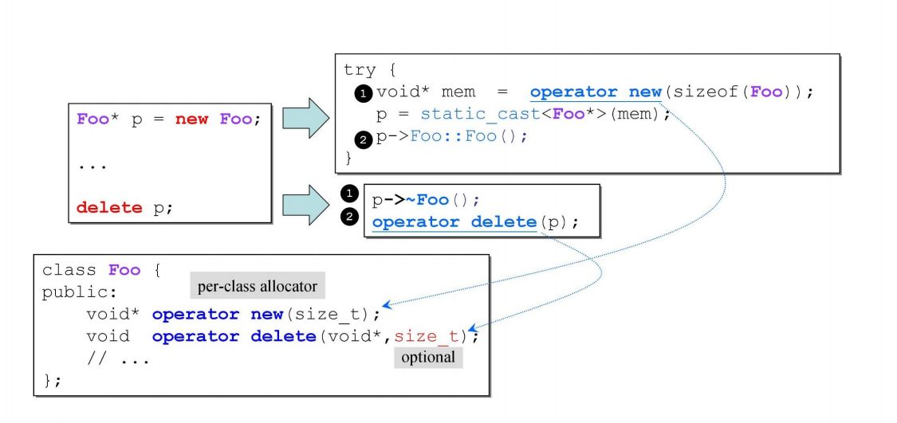

# 
__内存分配__

## __内存申请__

- 第一步:通过operator new()操作分配了一个目标类型的内存大小,这里是Complex的大小
- 第二步:通过static_cast<Complex*>将得到的内存块强制转换为目标类型指针,这里是Complex*
- 第三步:调用目标类型的构造方法,但需要注意的是直接通过pc->Complex::Complex(1, 2)这样调用构造函数只有编译器可以做,用户做将产生错误
- 注意:operator new()操作内部调用了malloc()方法

## __内存释放__

- 第一步:调用对象的析构函数
- 第二步:通过operator delete()函数来释放内存,本质上也是调用了free()函数

## __new array__

- 释放内存的时候,需要使用delete[],如果不使用delete[],只是使用delete,只会将分配的三块内存空间释放,但不会调用对象的析构函数,如果对象内部还使用了new指向其它空间,如果指向的该空间里的对象的析构函数没有意义,不会有问题,如果有意义,由于该部分对象析构函数没有调用,那么就会导致内存泄漏

## __c++内存分配的途径__

 

## __重载__
- 类的operator new 和operator delete

- 类的operator new[] 和operator delete[]

