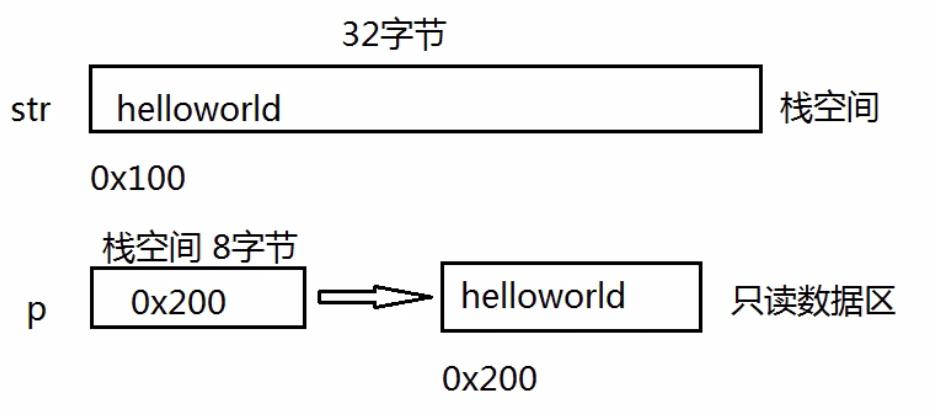
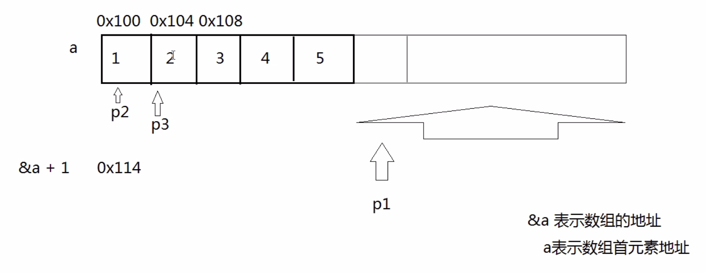

# __
指针
__
## __指针的长度__
- 在x64中指针都是8byte

## __*号的含义__
- 定义的时候(前面有类型)，表示后面的变量是指针
- 使用的时候，表示取值(取指针指向的内存空间的值)
- int* 和 char* 的步长是不一样的

## __xor__
- 0 xor 任何数 = 任何数
- 1 xor 任何数 = 任何数取反
- 任何数 xor 自己 = 把自己置0
-	负号运算

## __运算符优先级__
|type|	强制类型转换|
|-- | -- |
|++|自增|
|–|	自减|
|*|	取值|
|&|	取地址|

## __指针和数组的区别__

## __复杂类型__
- 右左法则
- int*(*(*fp)(int))[10]
  - fp是指针，指向函数，有一个int参数，返回指针，指向数组，数组有10个元素，每个元素都是int*型的
- int*(*(*array[5])())();
  - array是数组，有5个元素，数组元素是指针，指向是函数，无参，函数返回值是指针，指向一个函数，无参返回值是int指针

## __指针数组和数组指针__
- 指针数组：*数组名[数组长度]
- 数组指针：int (*p)[5]
- 二维数组数组名表示首行地址
- 二维数组数组名[0]表示首行首元素地址
- &数组名表示数组的地址

|表示形式|含义|地址值|
|-- | -- | -- |
|&a | 指向二维数组的指针 | 1000 |
|a | 二维数组名，指向一维数组a[0],即第0行首地址 | 1000 |
|a[0],*(a+0),*a| 第0行第0列元素地址 | 1000 |
|a+1, &a[1]| 第1行首地址 | 1006 |
|a[1],*(a+1)| 第1行第0列地址 | 1006 |
|a[1] + 2 ,*(a+1)+2,&a[1][2]| 第1行第2列地址 | 1010 |
|*(a[1] + 2) ,*(*(a+1)+2), a[1][2]| 第1行第2列元素的值 | 元素值为11 |

